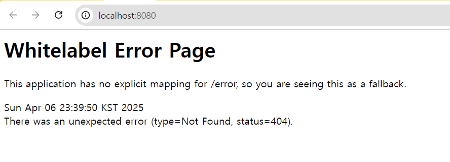

# 강의 정리
## 웹
웹은 클라이언트-서버 패러다임이다.
- 클라이언트: 데이터의 생성/조회/수정/삭제 요청을 전송
- 서버: 요청대로 동작을 수행하고 응답을 전송
하지만 클라이언트와 서버는 상대적인 것이다. 클라이언트는 서버에 요청을 하고 서버는 요청에 대한 응답을 전송해준다.

## 프로토콜과 HTTP
- 프로토콜: 네트워크 안에서 요청과 응답을 보내는 규칙
- 웹에서는 HTTP라는 프로토콜(규칙)을 사용한다.

HTTP를 통해 요청을 보낼 떈 HTTP Method, URL이 필요하다.
- HTTP Methd : 데이터를 다루는 방법 (동사)
- URL(Uniform Resource Location): 다룰 데이터의 위치 (목적어)

### 자주 사용하는 HTTP 메서드
- GET : 데이터를 가져온다. (조회)
- POST : 데이터를 게시한다. (생성)
- PUT : 데이터를 교체한다. (수정)
- PATCH : 데이터를 수정한다. (수정)
- DELETE : 데이터를 삭제한다. (삭제)

### URL 구조
**URL 구조**
https:// 프로토콜(scheme)
www.example.com 서버 주소(domain)
/user/1/nickname 서버 내 데이터 위치(path)
**Path Parameter**
https://www.example.com/user/{user_id}/nickname
**Query String**
.com/post/search?page=1&keyword=hello

    HTTP Method, URL은 편지 봉투 겉면에 적는 받는 주소와 같은 개념

### HTTP로 주고받는 데이터의 구조
- HTTP 헤더
- - 통신에 대한 정보 (누가 언제 보냈는지, HTTP method 종류, 요청 경로 등)
- HTTP 바디
- - 주고받으려는 데이터 (보통 json형식)

### 대표적인 상태코드
• 200 → 처리 성공 (ok)
• 201 → 데이터 생성 성공 (created)
• 400 → 클라이언트 요청 오류 (bad request)
• 404 → 요청 데이터 없음 (not found)
• 500 → 서버 에러 (internal server error)

## REST API
REST 아키텍처를 따르도록 설계한 API
여러가지 규칙이 있지만 간단하게 정리하면
• URL : 조작할 데이터 (명사)
• HTTP method : 데이터에 대한 행위 (동사)

세부적인 규칙 https://velog.io/@somday/RESTful-API-%EC%9D%B4%EB%9E%80

# API 명세
- 로그인: POST /login
- 로그아웃: POST /logout
- 회원가입: POST /signup

- 할 일 전체 조회: GET /todo/list
- 할 일 생성: POST /todo
- 할 일 수정: PATCH /todo/{todo_id}
- 할 일 삭제: DELETE /todo/{todo_id}
- 할 일 체크: POST /todo/{todo_id}/check
- 할 일 체크해제: POST /todo/{todo_id}/uncheck
- 일기 작성: POST /todo/diary

- 팔로우: POST /friends/{name}/follow
- 언팔로우: POST /friends/{name}/unfollow
- 팔로워 수: GET friends/follower/numbers
- 팔로워 목록: GET friends/followers/names
- 팔로우 수: GET friends/follows/numbers
- 팔로우 목록 GET friends/follows/names

# 에러 이미지
