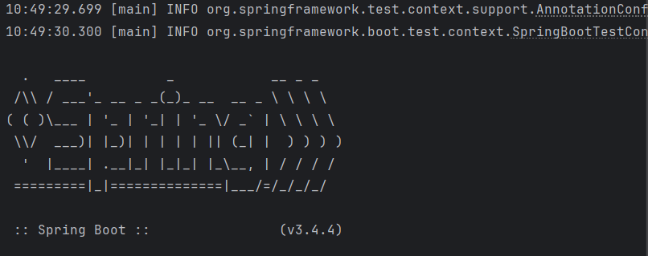
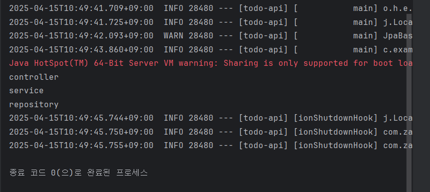

# 스프링
- JAVA 진영의 대표적인 백엔드 프레임워크
- 객체지향 원칙을 지키면서 개발할 수 있도록 도와준다

## 스프링 부트
- 스프링 프레임워크를 사용하여 개발할 때, 편의를 더해주는 도구
- 스프링으로 개발할 때는 스프링 부트를 함께 사용한다

-> 이번에 테스트에도 스프링 부트 어노테이션을 사용함
## 스프링 빈(Spring Bean)
- 어플리케이션 전역에서 사용할 공용 객체
- 스프링 컨테이너라고 하는 공용 창고에 빈(객체)을 저장해두고, 필요한 빈을 컨테이너에서 받아 사용한다.
- 필요한 빈은 스프링 프레임워크가 자동으로 가져다준다.
- 이때 빈을 요구하는 객체도 스프링 빈이다. (빈이 아닌 객체가 빈을 요구하면 프레임워크가 자동으로 가져다주지는 못한다)

## 스프링 컨테이너
- 스프링 빈이 저장되는 공간
- 어플리케이션 컨텍스트(Application Context)라고도 한다.

## 스프링 빈 저장
- 설정 파일 작성 (수동 등록)
- 컴포넌트 스캔 (자동 등록)
### 설정 파일 작성
- 설정 파일은 자바 클래스로 작성한다.
- 이때 클래스에 `@Configuration` 으로 설정 파일임을 명시한다.

- 클래스에 `@Configuration`, 메서드에 `@Bean` 어노테이션 사용
### 컴포넌트 스캔
- 빈을 생성할 클래스에 `@Component` 어노테이션 사용
- 어플리케이션을 시작할 때 `@Component`가 붙은 클래스를 찾아서 자동으로 빈 등록
- 컴포넌트 스캔은 `@ComponentScan` 어노테이션 사용

** 내가 등록할 빈을 생성하는 클래스에 `@Component`를 붙이면 끝!**

## 의존성 주입
**의존성 주입 (Dependency Injection, DI)** : 내가 의존하는 객체를 직접 생성하지 않고 밖에서 주입받는 것

- 빈을 사용할 때는 컨테이너에 직접 접근해서 빈을 꺼내지 않고, 프레임워크에게 필요한 빈(의존성)을 요청하고 받아서 사용한다.
- A의 기능을 실행하는데 B의 기능이 필요하다면, **'A는 B에 의존한다'**고 한다.
- 스프링에서는 컨테이너에 저장된 빈(객체)과 빈(객체)사이의 의존성을 프레임워크가 주입하는 것을 말한다.

### 의존성을 주입받는 이유
- 객체 지향 원칙 중 하나인 OCP(Open Close Principle) 원칙을 준수한다. (유지보수에 이점을 가짐)
- 매번 필요한 객체를 생성하는 대신, 생성해둔 객체를 사용하므로 메모리를 효율적으로 사용할 수 있다.

### 의존성 클래스 추가
상위 빈에 의존성 빈과 `@Getter`을 추가한다.

어떤 객체에 다른 객체를 주입하려면, 주입할 통로가 필요하다. 우리는 통로를 만들고, 이 통로를 주입해 달라고 표시해두면 프레임워크가 알아서 객체를 주입해준다.
통로는 크게 생성자, 필드, 메서드가 존재한다. 표시를 남길 때에는 `@Autowired` 어노테이션으로 표시를 남긴다.

#### 생성자 주입
의존성이 바뀔 일 없는 경우 안전하게 `final`로 선언한다. 이때 `final` 필드는 생성자를 통해 초기화되어야 한다.
생성자에 `@Autowired`을 사용하면, 생성자를 통해 빈을 주입한다. 만약 생성자가 하나라면 `@Autowired`를 생략할 수 있다.

`@RequiredArgsConstructor`을 사용하면 모든 final 필드에 대한 생성자를 자동으로 만들어주어 생성자 코드까지 생략할 수 있다.
#### 필드 주입
필드에 바로 `@Autowired` 어노테이션을 사용한다. 이 방식은 주로 테스트 코드에서 사용한다.

# 테스트 결과

---
공부를 하고 테스트를 해보는데, 빈은 그냥 객체이고 의존성 주입은 통로만 연결해주면 생각보다 쉽다고 생각이 들었다. 용어는 어렵지만 생각해보면 용어만 어려운 느낌이 드는데, 아직 초반이라서 할만한 걸지도 모르겠다.

테스트를 하다보니 이해가 되지 않았던 부분들이 살짝 이해가 된 것 같아서 다행이란 생각이 든다.