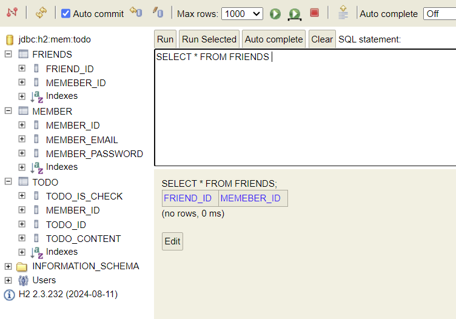
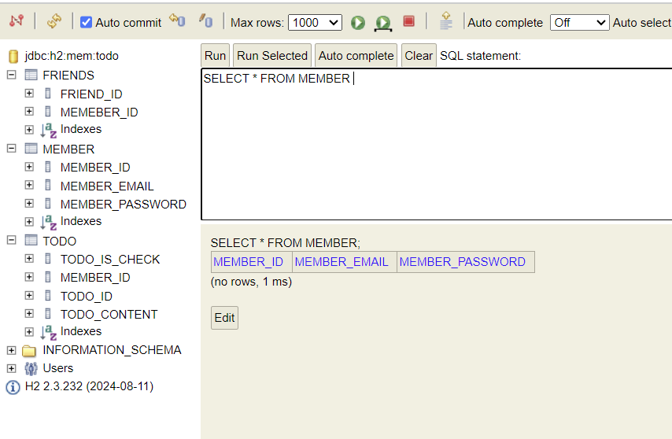
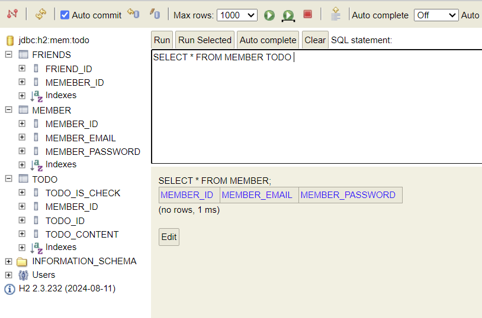

# DB 설계
문제 상황은 크게 개체(엔티티)와 그 사이의 관계로 나타낼 수 있다.

- 개체(Entity): 문제 상황을 구성하는 요소
- 관계(Relationship): 개체와 개체 사이의 관계

## ERD
문제 상황을 개체와 관계로 표현하는 방법을 **ER Model**(Entity-Relationship Model) 이라고 한다.
=> 이때 ER Model을 다이어그램으로 표현한 것을 **ERD**라고 한다.

## PK
개체와 관계는 세부적인 특징인 **속성**(Attribute)을 가질 수 있다.

‘사람‘ 개체는 ‘이름‘, ‘나이’ 속성을 가질 수 있고,
‘친구’ 관계는 시작된 ‘연도‘ 속성을 가질 수 있다.

이때 하나의 개체를 식별할 수 있는 속성을 **PK**(Primary Key)라고 한다.

## ERD를 DB설계
ER Model은 다음과 같이 DB로 구현할 수 있다.

- 개체 -> 테이블
- 관계 -> 테이블 or 외래키
- 속성 -> 테이블 컬럼

---

- ERD로 DB를 설계
- ERD를 그리는 도구로 **ERD Cloud**를 사용한다.

---
개체와 개체 사이의 관계에는 아래와 같은 종류가 있다.
- 다대일 (N:1)
- 일대다 (1:N)
- 일대일 (1:1)
- 다대다 (N:M)

ex) 1명의 유저는 여러개의 할 일을 생성할 수 있다. -> 1개의 할 일은 1명에 대한 할 일이므로 -> **유저 - 할 일** 관계는  **1 : N 관계**이다.

회원-동아리 관계는 **N : M 관계**이다.
=> N : M 관계는 테이블로 구현해야한다.

---
관계를 설정할 때는 보통 **비-식별 관계**를 선택한다.
- 식별 관계: 관계 대상의 PK를 자신의 PK로도 사용하는 것
- 비-식별 관계: 관계 대상의 PK를 자신의 FK로만 사용하는 것

# JPA
**JPA(Java Persistence API)**
데이터베이스에서 읽어온 데이터를 자바 객체로 매핑하는 자바의 표준 기술 (ORM)

- 엔티티(Entity)는 자바와 데이터베이스가 소통하는 단위
- 테이블의 데이터 하나(레코드)는 엔티티 객체 하나로 매핑된다.
- 엔티티 클래스를 정의하면, JPA가 엔티티 클래스 정의를 보고 **테이블을 생성하는 SQL**을 알아서 작성하고 실행한다.
    -> JPA를 사용함으로써 SQL을 작성하는 시간을 줄일 수 있다.

## DB 연결 정보 추가
- resources - **application.properties** 파일에 DB 접속 정보를 작성한다.
- 편의를 위해 이 파일의 확장자를 **yml**로 바꾼다.
- yml 파일은 콜론(:)을 사용하여 구분한다.

## 관리자 콘솔 접속
어플리케이션을 실행하고, <localhost:8080/h2-console> 에 접속

## 엔티티 클래스
- 엔티티 클래스는 **테이블**을, 클래스 필드는 **컬럼**을 나타낸다.
- **@Entity** 어노테이션으로 이 클래스가 엔티티라는 것을 명시
- **@Id** 어노테이션으로 PK 필드에 이 필드가 PK라는 것을 명시
- id 값은 보통 데이터를 생성할 때마다 자동으로 1씩 늘어남
    - **@GeneratedValue**를 사용하면 id 값을 자동으로 생성한다.
    - 이때 strategy는 IDENTITY로 설정한다 (키 값 결정을 DB에 위임)
- ERD에서 설계했던 Column 이름과 타입을 맞추기 위해 필드에 **@Column** 으로 이름과 타입을 명시한다
- 외래키 컬럼을 나타낼 때는 Long 타입의 외래키 필드 대신 해당 엔티티 타입의 엔티티 객체를 필드로 가지도록 설계한다.

## 엔티티 연관관계
외래키 필드에는 2가지 어노테이션을 지정해야 한다.
- FK 컬럼 정보를 명시하는 어노테이션 (컬럼 이름 등)
    => **@JoinColumn**
- 해당 외래키로 생기는 연관관계 종류를 나타내는 어노테이션
    => **@ManyToOne** @OneToOne @OneTOMany @ManyToMany

- @ManyToMany는 N:M 관계를 나타내는데, 이는 외래키 대신 테이블로 구현하므로 사용하지 않는다.
- @OneToMany는 1:N 관계이며, 1에 해당하는 엔티티에 N에 대한 연관관계를 명시하는 양방향 매핑에 사용된다.

---
연관관계 종류를 나타내는 어노테이션에는 **fetch** 속성이 있다.
- EAGER : **즉시 로딩**, Todo 객체 정보를 가져올 때 연결된 User 객체의 모든 정보를 함께 한번에 가져온다.
- LAZY : **지연 로딩**, Todo 객체 정보를 가져올 때 연결된 User 객체의 정보는 필요할 때 가져온다.

## 엔티티 생성자
- **@NoArgsConstructor**를 사용하여 인자 없는 생성자를 만든다.
- 이때 access 속성을 통해 접근 제한자를 protected로 설정한다.
    - JPA는 엔티티 객체를 다룰 때 public 또는 protected의 인자 없는 생성자가 필요하기 때문
- 추가로 엔티티 객체에 **@Getter**를 추가해 모든 필드에 getter를 만든다.

# Friend 콘솔

# Member 콘솔

# Todo 콘솔
