# 정리
## 스프링 Layered Architecture
### 서비스
- 어플리케이션의 비즈니스 로직이 담기는 계층
- **레포지토리 계층**과 소통하며 **엔티티, 또는 DTO**로 소통한다.
- 서비스 계층의 하나의 메서드에는 원자성을 갖는 로직을 기술한다.
- - 한 메서드 안에 여러 로직이 실행되야 한다.
- 로직의 원자성을 보장하기 위해 **서비스 계층에 메서드 단위로 트랜잭션을 적용**해준다.
### 컨트롤러 계층
- 클라이언트의 요청을 받고, 응답을 보내는 계층
---
**@ResponseBody** 사용하면 객체를 json 데이터로 변환해서 response body에 담아 응답한다.
- 데이터를 받는 **자바 객체**를 **DTO**(Data Transfer Object)라고 한다.

## 프로토콜과 HTTP
- 보통 어플리케이션과 관련된 데이터는 body에 담는다.
- HTTP 요청으로 보내는 데이터는 **Request Body**
- HTTP 응답으로 보내는 데이터는 **Request Body**에 담긴다.

## 과제를 하며..
### DTO
DTO는 요청을 받을 때 여러 변수들을 받을 수 있다.
실제로 사용할 때는 객체로 받는게 나을 것 같아서 DTO는 필수일 것 같다는 생각이 들었다.

PathParameter이었나 그건 사용하면 편하겠지만 아직까지는 굳이라는 생각도 든다.
### 코드
코드를 짜며 대충 짜면 안되겠다는 생각도 들었다.
내가 자꾸 상이한 메서드 이름을 사용하거나, 참조한 레포지토리나 서비스를 사용하지 않아서 내가 원하는 기능이 실행되지 않은 적이 많다..
# 과제
## 회원가입
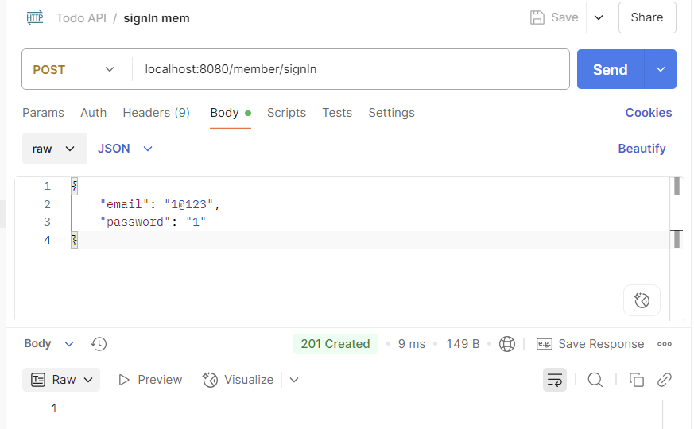
## 로그인
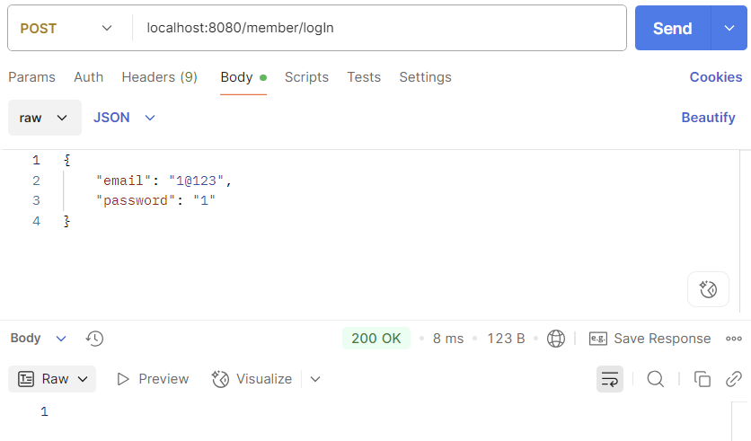
## 비밀번호 변경
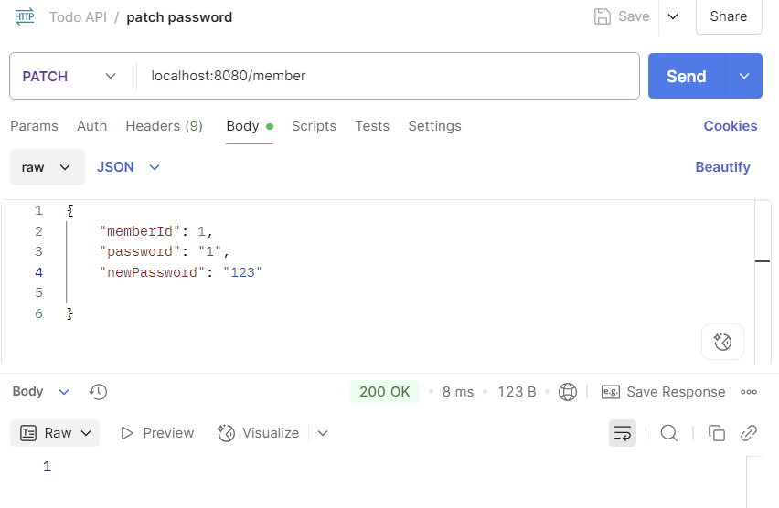
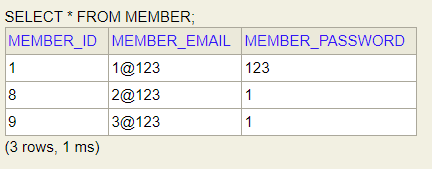
## 탈퇴
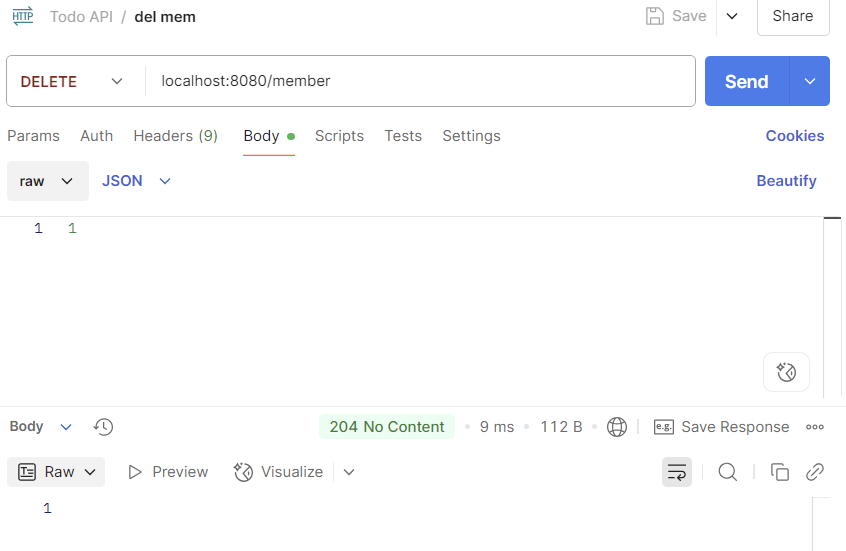
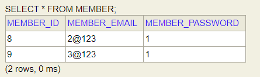
## todo 생성
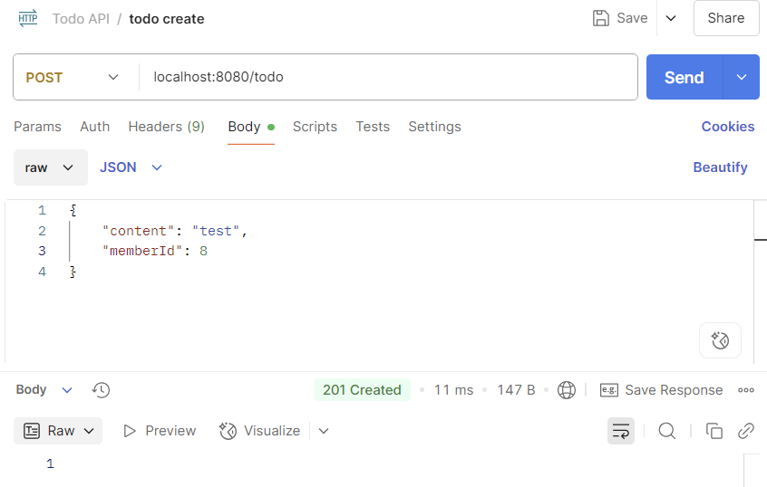
## todo 읽기
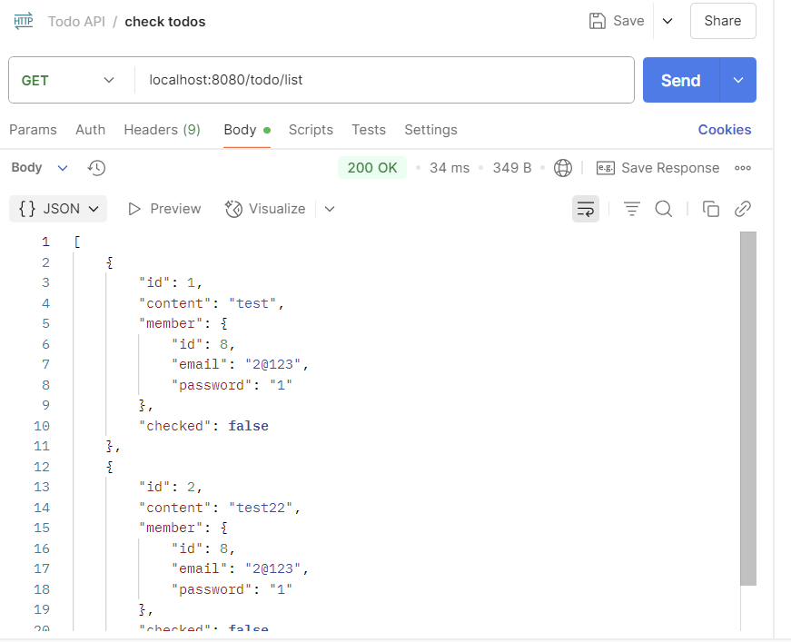
## todo 삭제
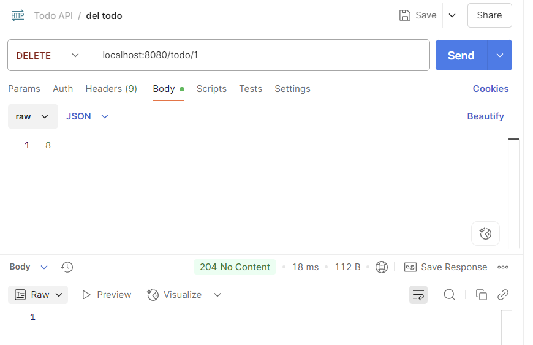
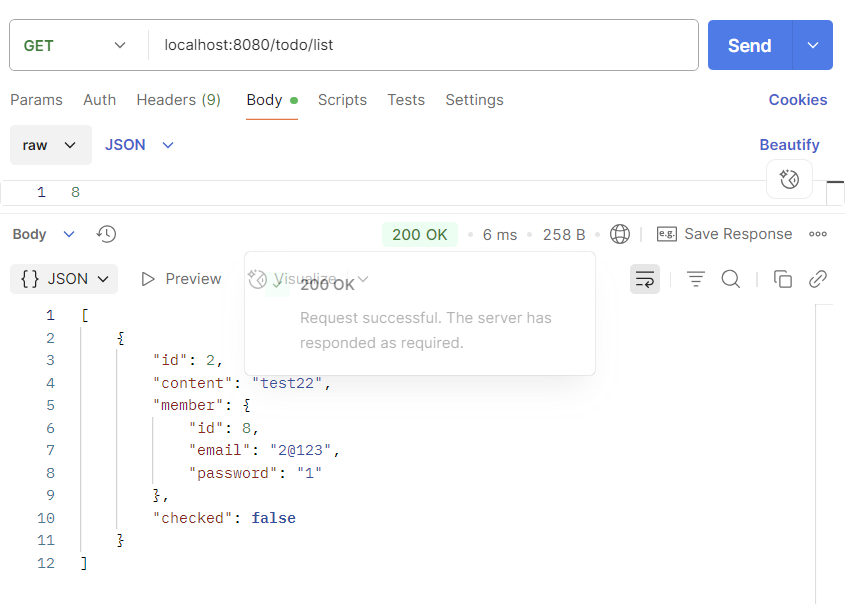
## todo 수정
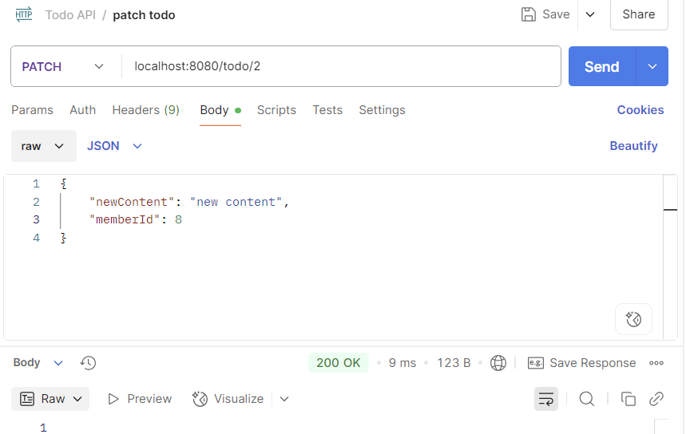
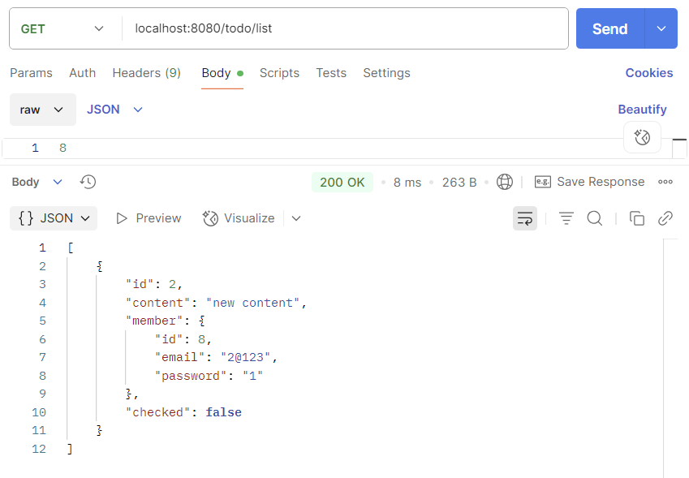