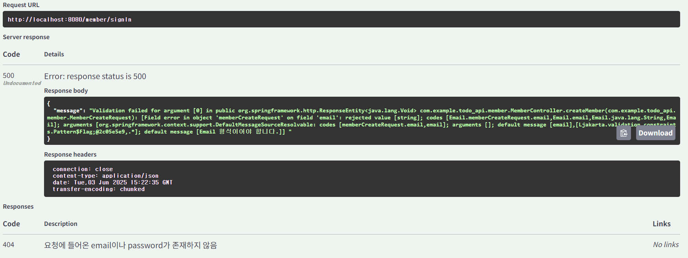
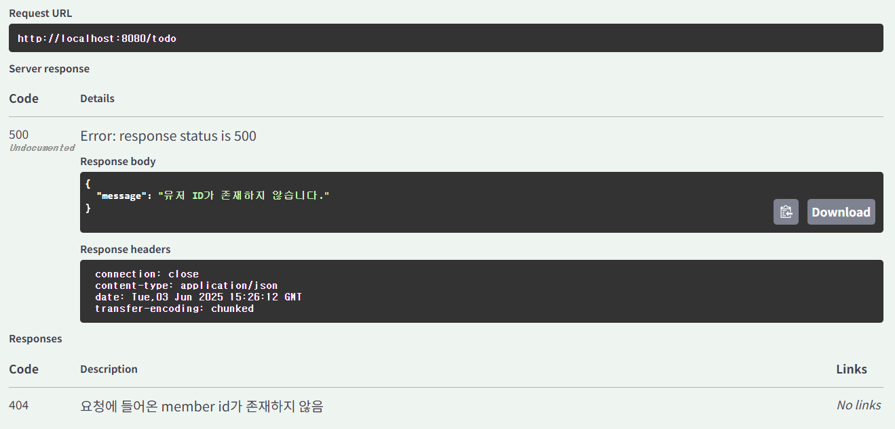

# 수업
## 유효성 검사
의도한 요청이 아닐 때의 처리
---
내가 설정해놓은 기준에 맞지 않는다면 에러가 발생하는데(email의 길이가 초과하거나 형식에 맞지 않는 등), 클라이언트는 어떤 것이 문제인지 알 수가 없다.

---
- 요청으로 들어오는 데이터가 **올바른 형식**인지 검사하는 것이다.
- 스프링에서는 데이터를 받아들이는 DTO에서 유효성을 검사한다.

스웨거에 외부 의존성을 추가해준다.
`implementation 'org.springframework.boot:spring-boot-starter-validation'`

DTO 클래스에 제약 사항과 에러 메시지를 명시한다.
- @Min(...)
- @Max(...)
- @NotNull
- NotBlank
- @Email
- @Size
---
RequestBody에 `@Valid`를 사용해서 명시된 제약 조건에 맞는지 검사한다.

## 예외처리
유효성 검사로 에러가 발생했지만, 왜 발생했는지 모른다.
-> 예외 처리를 통해서 에러 메시지를 담아보자

### Global Exception Handler
- 스프링은 예외 종류에 따라 응답할 response를 설정할 수 있는 **Global Exception Handler**를 제공한다.
- 스프링 어플리케이션 전역에서 발생하는 모든 에러에 대해 어떻게 처리할 지 결정한다.
- Global Exception Handler는 공통으로 사용하므로 **common** 패키지 밑에 생성한다.
---
- 에러가 발생하면 해당 에러 타입에 대한 핸들러가 기존 컨트롤러 대신 response body를 생성해 응답한다.
- 에러 클래스를 매칭할 때는, 상속관계를 따라 올라가며 매칭된다.
- Exception 클래스는 모든 에러 클래스의 공통 부모
    -> Exception 클래스에 대한 핸들러를 작성하면 특정 핸들러로 처리하지 못한 에러는 이 핸들러가 처리해준다.
### AOP
- Aspect-Roiented Programming (관점 지향 프로그래밍)
공통 관심사에서 실제 프로그램의 실행 중 관심사가 발생하는 곳을 찾아낸다
### 에러 메세지 클래스
- 예외 메세지를 상수로 정의한 클래스를 만든다
- 서비스에 작성한 에러 메시지를 상수로 변경한다.
## API 문서화
- API에 대한 사용법을 문서로 공유하는 것
Spring doc 의존성 추가
`implementation 'org.springdoc:springdoc-openapi-starter-webmvc-ui:2.6.0'`

- <http://localhost:8080/swagger-ui/index.html>을 접속해서 swagger-ui를 적용한 문서를 만들어준다
---
-@ApiResponse를 사용하여 status code마다 설명을 적을 수 있다.
'@ApiResponse(reponseCode = "404", description = "요청에 들어온 user id 가 존재하지 않음")
# 과제

